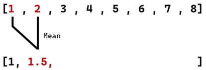
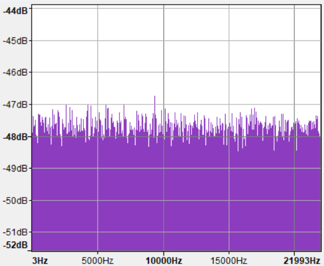
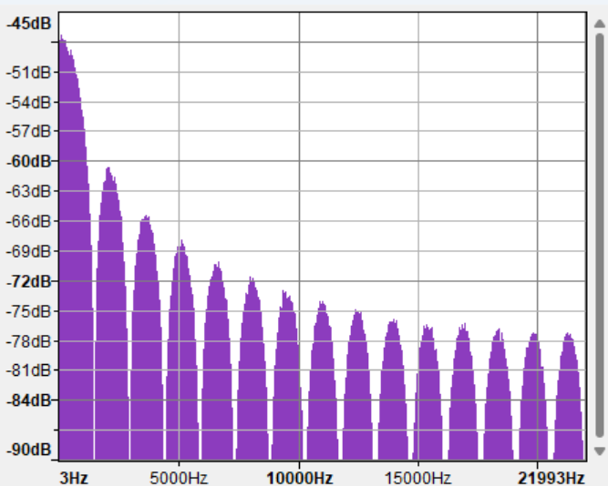
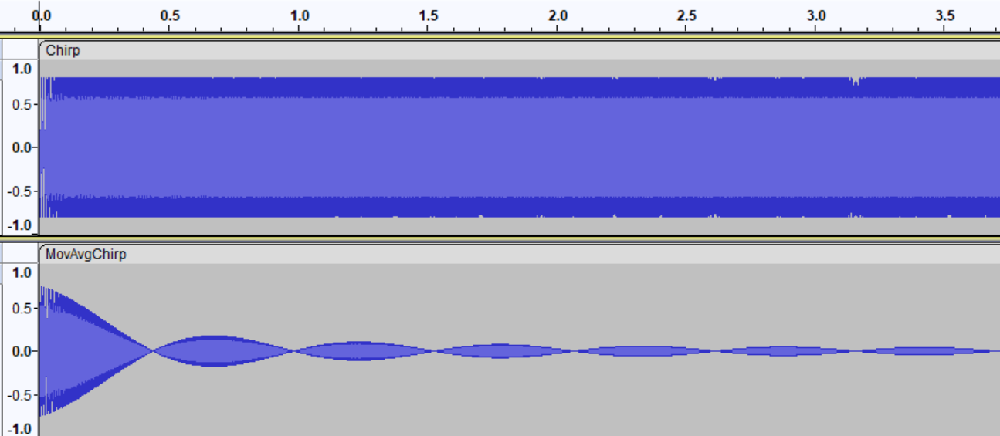

# Octave Audio Scripts

The octave audio scripts is a collection of scripts for [GNU Octave](https://octave.org/) 
that demonstrate 

# Requirements

- An installation of *GNU octave*
- A collection of audio files, preferably in the *Audios* directory. Various audio formats are supported.

**Note:** To check what formats are supported by your installation of Octave, use the *audioformats()*
function in your Octave command window.

# Usage

To use the Octave scripts, open an instance of Octave cli or gui and navigate the current working directory to the 
*OctaveAudioEditorScripts*, which is the root directory of this project, Or otherwise the directory containing
the script you want to execute. To navigate in Octave cli, use the *cd* command:

    octave:X> cd C:\Users\USER123\MyFolder\OctaveAudioEditorScripts

From there you can use any of the functions listed in the API below by typing in the function name into the command
window, followed by comma separated arguments, wrapped in brackets. For example

    VolumeChange(0.8, "Audios/Default.wav", "Out/VolumeDecreased.wav")

---

# API

### VolumeChange (*volume_factor*)
A convenience function for *VolumeChange(Volume_Factor, In_Path, Out_Path)* 
Increases or decreases the volume by *volume_factor*. A volume_factor of 0.5 will half
the audio amplitude and 2 will double the amplitude.

Assumes the *from* file is Audios/Default.wav
and the *out* file is Out/VolumeIncrease.wav. It is the equivalent to calling
*VolumeChange(volume_factor, "Audios/Default.wav", "Out/VolumeIncrease.wav")*

`volume_factor` - Coefficient of volume change.

### VolumeChange (*Volume_Factor, In_Path, Out_Path*)
Increases or decreases the volume by *volume_factor*. A volume_factor of 0.5 will half
the audio amplitude and 2 will double the amplitude.

`Volume_Factor` - Coefficient of volume change.  
`In_Path` - The path of the audio file to read from/edit  
`Out_Path` - The path of the file to write edited audio to

### AddEcho (*Depth, Delay*)
A convenience function for AddEcho(*Depth, Delay, In_Path, Out_Path*). Equivalent of calling
AddEcho (*Depth, Delay, "Audios/Default.wav", "Out/EchoAdded.wav")

### AddEcho (*Depth, Delay, In_Path, Out_Path*)
Adds an echo effect onto audio. The audio will have added repetitions of itself quieter
by a coefficient of *Depth* and will be repeated at intervals spaced *Delay* seconds apart

`Depth` - How much quieter should each echo be than the previous  
`Delay` - How far echos should be "spaced out"  
`In_Path` - The path of the audio file to read from/edit  
`Out_Path` - The path of the file to write edited audio to

### MovingAverageLPF (*Envelope_Size*)
A convenience function for MovingAverageLPF(*Envelope_Size, In_Path, Out_Path*).  
Equivalent of calling MovingAverageLPF(*Envelope_Size, "Audios/Default.wav", "Out/MovingAverageLPF.wav"*).

### MovingAverageLPF(*Envelope_Size, In_Path, Out_Path*)
A Moving average, Finite Impulse Response. Low Pass filter for audio.  It
uses an unweighted convolution that takes the mean of an envelope of samples, creating a new sample.
The envelope has a size of *Envelope_Size*. At the beginning of its convolution, 
where it does not have enough data for the full envelope, it performs and average on the data it has. This is
to prevent the start of the input from being truncated (See diagram below). 

  
A diagram showing how the Moving Average LPF behaves on a vector. Envelope_Size = 4

We can see below how the Moving Average LPF effectively filters a 500Hz signal buried in noise (Middle), creating
a clearer signal (Bottom) without a significant loss in amplitude, compared to the original sinusoid with no noise added (Top)  

However, the moving average filter is flawed because of its disproporsionate attenuation of different frequncies. This is an inherent flaw with
moving average signals.

When white noise (Left) is passed through, our filter's disproporsionate nature is shown as 'troughs' of attenuated frequencies (Right).   *Note that the scale is not the same on the diagrams*  

 
Freqency plot of white noise (Left) and frequency plot of white noise passed through Moving Average LPF (Right)

A similar effect is seen on a chirp signal (Top) after being passed through the filter (Bottom)

